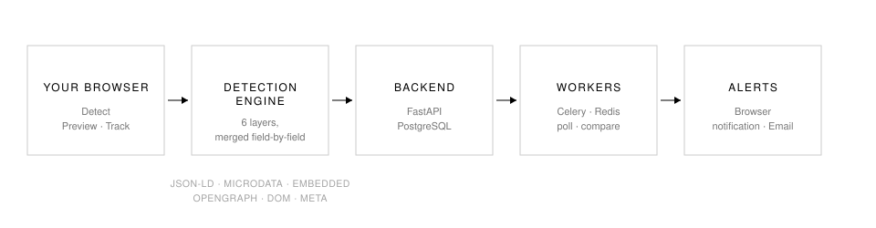
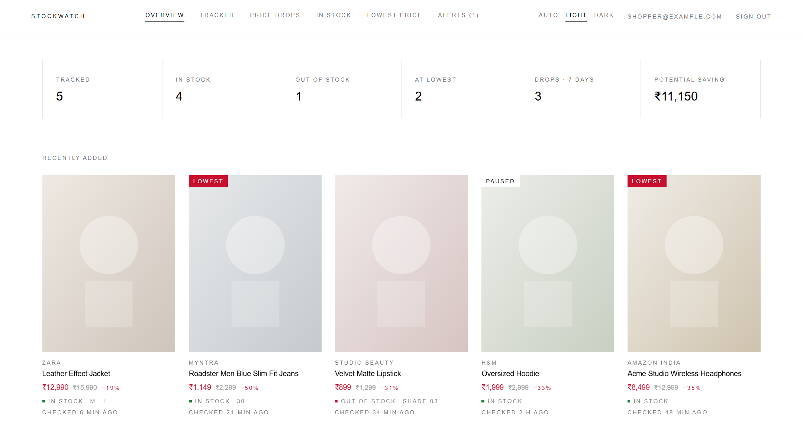
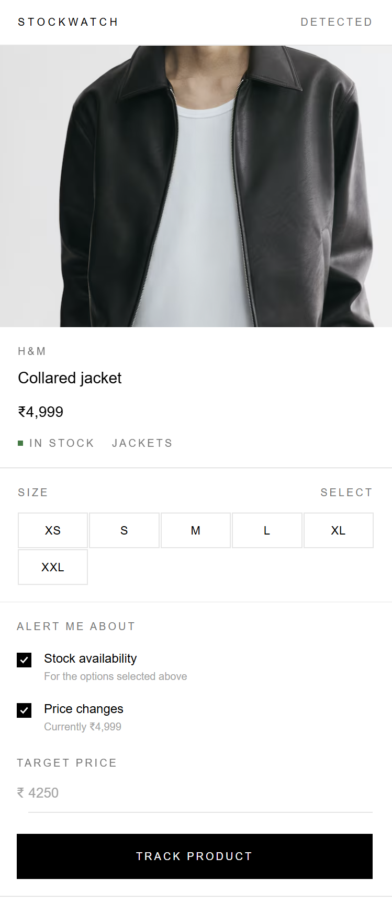

<div align="center">


# StockWatch

**Open any product page. Click once. It already knows.**

A universal product tracker — one detection engine that reads Zara, H&M, Myntra,
AJIO, Nykaa, Amazon, Flipkart, Nike, Adidas, Uniqlo, ASOS, Decathlon, Sephora…
_and the store you found last week that nobody has heard of._

Browser extension for capture · FastAPI + Celery for monitoring · alerts by
browser notification and email.

[](https://developer.chrome.com/docs/extensions/mv3/intro/)
[](https://www.typescriptlang.org/)
[](https://fastapi.tiangolo.com/)
[](https://www.postgresql.org/)
[](https://docs.celeryq.dev/)
[](#testing)

</div>

---

## The idea

Every restock tracker asks you to paste a URL and pick your store from a
dropdown, then works on nine sites. StockWatch inverts that: you are already
looking at the product, so the extension reads *the page you are on*, and the
engine that reads it does not know the name of a single store.

<p align="center">
  
</p>

## What it does

| | |
|---|---|
| **Detects** | Name, brand, price, MRP, discount, image, SKU, category, currency, and **per-size stock** on any store, from structured data down to DOM heuristics |
| **Tracks** | Variant-level. You watch *your* size, and stock is reported for that size — not for whatever the store happens to have left |
| **Monitors** | Server-side on a polite schedule, with retries, exponential backoff, per-host throttling and robots.txt |
| **Remembers** | Every price observation, so lowest / highest / average / 7-day / 30-day are real numbers |
| **Judges** | Turns that history into one word — **good time to buy**, fair, or high — and shows the reasoning |
| **Obeys** | Watch rules you write: *this size, back in stock, under ₹10,000, tell me on Discord* |
| **Alerts** | Browser, email and Discord, deduplicated so a price that holds never pings twice |
| **Never guesses** | A failed request is `unknown`, never "out of stock" |

## Why it works on stores nobody wrote code for

Six layers run on every page, merged **field by field** by trust and not one
winner per page.

| # | Layer | Reads | Why it earns its place |
|---|-------|-------|------------------------|
| 1 | **JSON-LD** | `schema.org/Product` | Google Merchant effectively requires it, so a large share of stores publish a complete product — often one `Offer` per size, with availability |
| 2 | **Microdata** | `itemscope` / `itemprop` | Same vocabulary, older storefronts |
| 3 | **Embedded JSON** | `__NEXT_DATA__`, `__PRELOADED_STATE__`, `dataLayer`, `utag_data`, Apollo… | **No per-store paths.** The blob is walked and every object *scored* on how much it looks like a product |
| 4 | **OpenGraph** | `og:*`, `product:price:amount` | Kept accurate by everyone who wants link previews |
| 5 | **DOM heuristics** | Biggest heading, boldest price, struck-through MRP, greyed-out size buttons, "Add to bag" | The layer that makes an unknown boutique work on day one |
| 6 | **Meta tags** | Twitter cards, `<title>`, `rel=canonical` | Enough to name a product and give the backend a stable URL |

A page routinely takes its **name** from JSON-LD, its **sale price** from the
DOM, and its **per-size stock** from the rendered widget. No single layer would
have produced that combination.

Store adapters then fill gaps — they are an enhancement, never a requirement.
Delete every adapter and the nine "supported" stores still work.

### The rule that matters most

```ts
type StockStatus = 'in_stock' | 'out_of_stock' | 'unknown';
```

Stock is three-valued everywhere, in both the TypeScript and the Python
implementation. A failed request, an unhydrated page, or a size widget we did
not recognise is **`unknown`** — never `out_of_stock`. A tracker that guesses
"sold out" wakes you at 3am for a restock that never happened.

### Your size, not the store's stock

A jacket whose XXL is available is not "in stock" to someone waiting on an M.
Every product therefore carries two answers — what the store says, and what the
store says about **the sizes you watch** — and the interface only ever shows the
second. Watch nothing in particular and they are the same number.

## Knowing when to buy

A chart tells you what happened. It does not tell you what to do.

Each product's history is reduced to one of three words, with the sentence
behind it:

> **Good time to buy** · 12% below the 30-day average
> **Price is high** · 8% above the 30-day average
> **Fair price** · within a few percent of the 30-day average

Underneath sit the numbers it came from — 30-day average and median, what buying
now saves against that average, all-time low and high, how much this price moves
(as a percentage, so a ₹900 t-shirt and a ₹90,000 laptop compare), and where
today sits in its own history: *cheaper than 80% of checks*.

Below four observations the verdict is **unknown** and says so. Three readings
are not a distribution, and a tracker that dresses one up as advice has spent
its credibility before the first real drop.

### Watch rules

The heuristics are a default, not a straitjacket. A rule is a sentence:

> *M* · **back in stock** · **and** price **below ₹10,000** → browser · email · Discord

Rules are per product, optionally per variant, and combine stock and price with
`all` or `any`. Once a product has one, its rules become the whole policy for it
— someone who has written down what they want should not also get what we
guessed.

Two decisions worth knowing about:

- **Back in stock is a transition.** It fires on the check where your size
  crosses from sold out to available, not on every check while it stays there.
- **Unknown never triggers anything.** A failed fetch is not news.

### Alerts that answer the question

An alert exists to answer *should I act on this*, so it carries the reason:
the product, the size, the price, what it was, and the context that makes it
worth reading — "12% below the 30-day average" — with one button to the product
page. Delivered to the browser, to email via Resend, and to Discord via a
channel webhook you paste into Settings. A webhook Discord has deleted costs you
one alert, not the run.

## Interface

Modelled on how a fashion retailer presents a product rather than how a
dashboard presents a metric: white space, hairlines, no rounded corners,
uppercase wide-tracked labels against normal-case product names, and colour
reserved for one red (reduced) and one green dot (in stock).

**Light, dark, or follow the system.** The choice sits in the popup footer and
the dashboard header, and is shared between them. It is applied before the
first paint, so opening the popup never flashes the wrong theme.

### Dashboard

Everything you track, with the numbers that decide whether to buy: what is at
its record low, what came back in stock, what a purchase would save you today.

<p align="center">
  
</p>

### Popup

Open a product page, click once, and the product is already there — read from
the page you are on, not from a URL you had to paste.

<p align="center">
  
</p>

**Sold-out sizes stay visible, struck through, and selectable.** Being told the
moment *your* size returns is the entire point, so a chip has to be able to say
"sold out" and "selected" at the same time.

The confidence score and the layer that produced each field sit behind
**Detection** at the bottom of the popup. When a store changes its markup,
that panel is the difference between "detection broke" and "the JSON-LD price
went stale and we correctly fell through to the DOM".

<p align="center"><sub>Both screenshots are the extension running against live store pages.
Product photography belongs to the retailers.</sub></p>

## Quick start

Requires Docker, Node 18+, and a Chromium browser.

```bash
git clone https://github.com/NekoTensor/stockwatch.git && cd stockwatch
```

**backend**

```bash
cp .env.example .env && docker compose up --build -d
```

**extension**

```bash
cd extension && npm install && npm run build
```

Then `chrome://extensions` → Developer mode → **Load unpacked** → select
`extension/dist`. Pin it, open any product page, click the icon, create an
account in the popup, and press **Track product**.

API docs are at <http://localhost:8000/docs>.

<details>
<summary><strong>Running the backend without Docker</strong></summary>

```bash
cd backend && python -m venv .venv && .venv/bin/pip install -r requirements-dev.txt
```

```bash
cd backend && .venv/bin/alembic upgrade head && .venv/bin/uvicorn app.main:app --reload
```

Workers need Redis:

```bash
cd backend && .venv/bin/celery -A app.worker.celery_app worker --loglevel=info
```

```bash
cd backend && .venv/bin/celery -A app.worker.celery_app beat --loglevel=info
```
</details>

> **Signing in needs the backend running.** The extension talks to
> `http://localhost:8000/api` by default; if nothing is listening there, the
> popup says so and offers a **Server** field to point it elsewhere. Start it
> with `docker compose up -d`, or run `uvicorn app.main:app` from `backend/`.

## Try it

| Store | What you should see |
|-------|--------------------|
| zara.com | Name, price, every size, and which are struck through |
| www2.hm.com | Price from OpenGraph, sizes from the rendered widget |
| myntra.com | Product read out of embedded app state, MRP + discounted price |
| nykaafashion.com | Shade variants, typed as shades rather than sizes |
| amazon.in | Title, price, list price, ASIN, twister variants |
| *any small store* | Generic detection — the interesting one |

Open **Detection** at the bottom of the popup to see the confidence score, the
layers that fired, and **which layer produced each field**.

## Privacy

- **No content script and no host permissions for shops.** The manifest asks for
  `activeTab`, `scripting`, `storage`, `alarms`, `notifications`. Code is
  injected only when *you* click the icon, and only into that tab.
- **No secrets in the browser.** The extension holds a session token; the
  database URL, JWT signing key and Resend key live on the server.
- **Your own server.** The API base URL is editable in the popup.

## Architecture

```
stockwatch/
├── extension/                  Chrome MV3 · React · TypeScript · Tailwind
│   ├── src/detection/          the engine — no store knows its name
│   │   ├── layers/             jsonld · microdata · embedded · opengraph · metatags · dom
│   │   ├── merge.ts            field-by-field resolution + variant merging
│   │   └── pipeline.ts         orchestration · normalisation · confidence
│   ├── src/adapters/           generic + zara · hm · nykaa · myntra · ajio ·
│   │                           amazon · nike · adidas · uniqlo
│   ├── src/popup/              detect → preview → choose sizes → track
│   ├── src/dashboard/          overview · products · price history · alerts
│   └── src/background/         badge + alert delivery
│
├── backend/                    FastAPI · SQLAlchemy · Alembic · Celery
│   ├── app/detection/          the same six layers, in Python
│   ├── app/adapters/           the same adapter contract, in Python
│   ├── app/monitoring/         fetcher (retry · backoff · throttle · robots)
│   ├── app/services/changes.py what changed
│   ├── app/notifications/      what is worth an interruption, and email
│   └── app/worker.py           Celery tasks + beat schedule
│
└── docs/                       architecture · detection · api
```

**The detection engine exists twice** — once in TypeScript for the browser, once
in Python for the workers — and both are held to the same test fixtures. That
matters: if they disagreed, the first monitored check after tracking would
report a change that never happened.

## Testing

```bash
cd extension && npm run check
```

```bash
cd backend && .venv/bin/pytest
```

**214 tests, no network and no browser required.** Detection runs against saved
page *shapes* rather than copies of one store, monitoring runs against a mocked
transport, and the notification rules are asserted directly:

- `out → in` notifies; staying in stock does not; `out → in → out → in` notifies twice
- a price that drops notifies; the same price again does not; a bounce does
- a timeout, a 429, a 404 and a bot wall all leave stock **exactly as it was**
- a rule for M ignores L returning; `back_in_stock` does not re-fire while it stays in stock
- the verdict abstains under four observations, and `unknown` satisfies no condition

There is also a preview harness that renders the real popup and dashboard in an
ordinary tab, running the real pipeline against fixtures:

```bash
cd extension && npm run preview
```

Then `/dev/preview.html?f=dom-only` or `/dev/preview.html?view=dashboard`.

## Adding a store

Create `extension/src/adapters/<store>/index.ts`, implement only what your store
does *differently*, and register it. Nothing in the pipeline changes.

```ts
export const MyStoreAdapter = createStoreAdapter({
  id: 'mystore',
  label: 'My Store',
  domains: ['mystore.com'],
  brand: 'My Store',
  idPattern: /\/p\/(\d{6,})/i,
});
```

If you find yourself copying generic extraction into an adapter, that logic
belongs in a layer instead — where every store gets it for free.

## License

MIT
